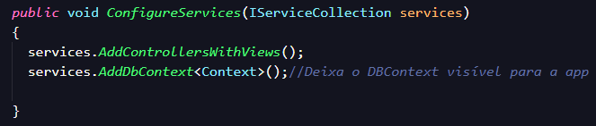
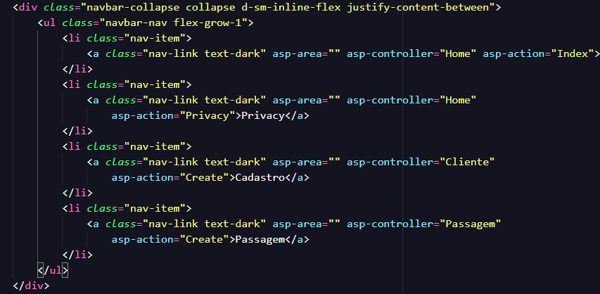

# Sobre:
  - Um exemplo de CRUD
  - SDK usado .net 5.0
  - OBS:  Na hora de criar o projeto no VS, não se esqueça de marcar a opção "Adicionar solução no mesmo diretório" (Provavelmente não está com as mesmas palavras kkk...)

# Comandos usados:

  ## EntityFrameworkCore:
  -> Ele serve para fazer as integrações com o Banco de dados (A grosso modo)

  - `dotnet tool install --global dotnet-ef`
  - `dotnet add package Microsoft.EntityFrameworkCore.Design --version 5.0`
  - `dotnet add package Microsoft.EntityFrameworkCore.Tools --version 5.0`

  ## Provedor do Banco de dados:
  -> Especifica qual Banco vamos utilizar

  - `dotnet add package Microsoft.EntityFrameworkCore.SqlServer --version 5.0`
  
  ## Migrations:
  -> Basicamente ele transforma uma classe em uma tabela no banco de dados, também é usado para fazer atualizações e migrações de banco de dados.

  - `dotnet ef migrations add nomeDaMigration` = Gera as migrations e relações do banco de dados

  - `dotnet ef database update` = Joga as informações geradas para o Banco de dados

  ## Scaffolding:
  -> Serve para criar códigos automáticos no vscode, como por exemplo gerar o Controller e as Views a partir de uma classe model e o contexto do Banco de dados. No Visual Studio ele consegue fazer isso com o clique direito do mouse.

  - `dotnet add package Microsoft.VisualStudio.Web.CodeGeneration.Design --version 5.0.0` (Versão usada no projeto)

  -> Exemplo de geração automática:
  - `dotnet aspnet-codegenerator controller --force --controllerName ClienteController --model CRUD.Models.Cliente --dataContext CRUD.Models.Context --relativeFolderPath Controllers --controllerNamespace CRUD.Controllers `
  
  - `dotnet aspnet-codegenerator controller --force` = Especifica o que vai ser gerado
  - `--controllerName ClienteController` = Especifica o nome do controller  
  - `--model CRUD.Models.Cliente` = Especifica qual classe da model ele terá como base, ou seja, quais regras de negócio o controller vai ter.
  - `--dataContext CRUD.Models.Context` = Define o contexto do banco de dados, onde contém a string de conexão e o tipo de banco. 
  - `--relativeFolderPath Controllers --controllerNamespace CRUD.Controllers` = Define em qual pasta o controller será criado e qual é o namespace que ele terá 

# Roteiro:
  <ol>
    <li>Criar projeto no Visual Studio MVC, depois de criar o projeto você pode abrir a pasta dele no vscode. (Foi o jeito que eu encontrei de conseguir rodar a aplicação em ambas as IDES, se souber de outro manda pra "Nois")</li>
    <li>Criar o contexto de banco de dados (Que se encontra no arquivo <a href="./Models/Context.cs">Context.cs</a>)</li>
    <li>Adicionar o contexto do banco na classe "Startup.cs":
      
     </li>
     <li>Criar alguma Classe na model que será uma tabela (Neste projeto foi as Classes Cliente e Passagem)</li>
     <li>Adicionar ao Contexto do banco de dados `public DbSet"<"Cliente">" Clientes { get; set; }` (Para informar para o banco que aquela classe será uma tabela o nome informado após <Cliente> pode ser qualquer coisa, este nome será o nome da tabela no banco)</li>
     <li>Gerar o Scaffolding (Gerar os controllers de for automática, os comandos se encontram mais abaixo)</li>
     <li>Agora é sucesso, você já consegue acessar através das rotas</li>
     <li>Caso queira inserir no cabeçalho acesse <a href="./Views/Shared/_Layout.cshtml">_Layout.cshtml</a> e adicione mais um "li" com as devidas alterações</li>
    
  </ol>

